# TikZ Figures

Convert `pdf` figures to `png` in the folder `figs`:

```bash
ls -1 | sed -e 's/\..*$//' | xargs -t -i pdftoppm {}.pdf {} -png -singlefile
```

## SEM

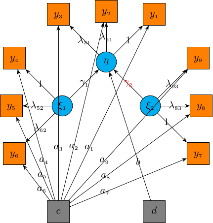

## Normal (I)

```tex
\documentclass[tikz]{standalone}
\usepackage{pgfplots}
\usepackage{mathpazo}
\usepgfplotslibrary{polar}
\usepgflibrary{shapes.geometric}
\usetikzlibrary{calc}
\usetikzlibrary{datavisualization}
\usetikzlibrary{datavisualization.formats.functions}
\pgfplotsset{compat=1.12} 
\pgfplotsset{my style/.append style={axis x line=middle, axis y line=middle, xlabel={$x$},ylabel={$y$},smooth}}
%\tikzset{elegant/.style={smooth,thick,samples=50,cyan}}
%\tikzset{eaxis/.style={->,>=stealth}}
 
\begin{document}
\begin{tikzpicture}
	\begin{axis}[my style, xmin=-3.5,xmax=3.5,ymin=-0.02,ymax=0.45]
	\addplot[domain=-3:3]{1/sqrt(2*pi)*exp(-x^2/2)};
	\end{axis}
\end{tikzpicture}
\begin{tikzpicture}
	\begin{axis}[my style, xtick={-2,-1,0,1,2},xmin=-10,xmax=10,ymin=-10,ymax=10]
	%\addplot[domain=-3:5]{-abs(x-1)+3};
	%\addplot[domain=-7:1]{-x-2};
	\addplot[domain=-3:3]{exp(-x)*exp(-exp(-x))};
	%\addplot[domain=-3:3]{1/sqrt(2*pi)*exp(-x^2/2)};
	%\addplot[mark=*] coordinates{(1,-3)};
	%\addplot[mark=*,fill=white] coordinates{(1,1)};
	\end{axis}
\end{tikzpicture}
\begin{tikzpicture}[scale=1]
\datavisualization [school book axes, visualize as smooth line/.list={normal},all axes = {length=4cm,ticks = some},x axis ={label=$x$},y axis ={label=$y$},normal={pin in data={text=$y{=}\frac{1}{\sqrt{2\pi}}e^{-\frac{x^2}{2}}$,when=x is 0.5}}]
data [format=function] {
var x : interval [-2.5:2.5];
func y = 1/sqrt(2*pi)*exp(-(\value x)^2/2);
};
\end{tikzpicture}
 
\end{document}
```

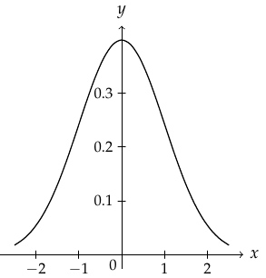

## Normal (II)

```tex
\documentclass[tikz]{standalone}
\usepackage{pgfplots}
\usepackage{mathpazo}
\usepgfplotslibrary{polar}
\usepgflibrary{shapes.geometric}
\usetikzlibrary{calc}
\usetikzlibrary{datavisualization}
\usetikzlibrary{datavisualization.formats.functions}
\pgfplotsset{compat=1.12} 
\pgfplotsset{my style/.append style={axis x line=middle, axis y line=middle, xlabel={$x$},ylabel={$y$},smooth}}
\begin{document}
\begin{tikzpicture}[scale=1]
\datavisualization [school book axes, visualize as smooth line/.list={normal},all axes = {length=4cm,ticks = some},x axis ={label=$x$},y axis ={label=$y$}]
%,normal={pin in data={text=$y{=}e^{-x}e^{-e^{-x}}$,when=x is 0.5}}]
data [format=function] {
var x : interval [-2.15:6.2];
func y = exp(-\value x)*exp(-exp(-\value x));
};
\end{tikzpicture}
\end{document}
```

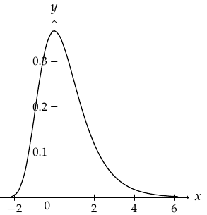

## Normal (III)

```tex
\documentclass[tikz]{standalone}
\usepackage{pgfplots}
\usepackage{mathpazo}
\usepgfplotslibrary{polar}
\usepgflibrary{shapes.geometric}
\usetikzlibrary{calc}
\usetikzlibrary{datavisualization}
\usetikzlibrary{datavisualization.formats.functions}
\pgfplotsset{compat=1.12} 
\pgfplotsset{my style/.append style={axis x line=middle, axis y line=middle, xlabel={$x$},ylabel={$y$},smooth}}
\begin{document}
\begin{tikzpicture}[scale=1]
\datavisualization [school book axes, visualize as smooth line/.list={mynode},x axis ={label=$x$,ticks={step=2,minor steps between steps=1}},y axis ={label=$y$}]
%{major={at={0.05,0.10,0.15,0.20}}}}]%step=0.05,minor steps between steps=1}}]
data [format=function] {
var t : interval [0:pi];
func x = 2*cos(\value t r);
func y = 1/(pi)*sin(\value t r);
};
\end{tikzpicture}
\end{document}
```


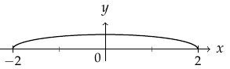

## Normal (IV)

```tex
\documentclass[tikz]{standalone}
\usepackage{pgfplots}
\usepackage{mathpazo}
\usepgfplotslibrary{polar}
\usepgflibrary{shapes.geometric}
\usetikzlibrary{calc}
\usetikzlibrary{datavisualization}
\usetikzlibrary{datavisualization.formats.functions}
\pgfplotsset{compat=1.12} 
\pgfplotsset{my style/.append style={axis x line=middle, axis y line=middle, xlabel={$x$},ylabel={$y$},smooth}}
\begin{document}
\begin{tikzpicture}[scale=1]
\datavisualization [school book axes, visualize as smooth line/.list={mynode},x axis ={label=$x$,ticks={step=2,minor steps between steps=1}},y axis ={label=$y$}]
%{major={at={0.05,0.10,0.15,0.20}}}}]%step=0.05,minor steps between steps=1}}]
data [format=function] {
var x : interval [0.05:4];
func y = 1/(2*pi)*sqrt(4/(\value x) - 1);
};
\end{tikzpicture}
\end{document}
```

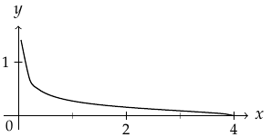

## LLP

```tex
\documentclass[tikz]{standalone}
\usepackage{pgfplots}
\usepackage{mathpazo}
\usepackage{amsmath}
\usepgfplotslibrary{polar}
\usepgflibrary{shapes.geometric}
\usetikzlibrary{calc}
\usetikzlibrary{datavisualization}
\usetikzlibrary{datavisualization.formats.functions}
\usetikzlibrary{intersections}
\usetikzlibrary{scopes}
\pgfplotsset{compat=1.12} 
\pgfplotsset{my style/.append style={axis x line=middle, axis y line=middle, xlabel={$x$},ylabel={$y$},smooth}}
\begin{document}
\begin{tikzpicture}[scale=1]
	\draw[gray, very thin] (0, 0) grid (12, 12);
	\draw[->, thick] (-1, 0) -- (13, 0) node[right] {$x$};
	\draw[->, thick] (0, -1) -- (0, 13) node[above] {$y$};
	\foreach \x in {1, 2, 3, 4, 5, 6, 7}
		\draw[xshift = \x cm] node[below] {$\x$};
	\foreach \y in {1, 2, 3, 4, 5, 6, 7}
		\draw[yshift = \y cm] node[left] {$\y$};
	\foreach \x in {8, 8.2, ..., 11}
		\draw[xshift = \x cm] node[below] {$.$};
	\foreach \y in {8, 8.2, ..., 11}
		\draw[yshift = \y cm] node[left] {$.$};
	\foreach \x in {12}
		\draw[xshift = \x cm] node[below] {$m$};
	\foreach \y in {12}
		\draw[yshift = \y cm] node[left] {$n$};
	\draw[->, blue, very thick] (1, 1) -- (1.5, 1);
	\draw[->, blue, very thick] (1.5, 1) -- (2.5, 1);
	\draw[->, blue, very thick] (2.5, 1) -- (3.5, 1);
	\draw[->, blue, very thick] (3.5, 1) -- (4, 1);
	\draw[->, blue, very thick] (4, 1) -- (4, 1.5);
	\draw[->, blue, very thick] (4, 1.5) -- (4, 2.5);
	\draw[->, blue, very thick] (4, 2.5) -- (4, 3);
	\draw[->, blue, very thick] (4, 3) -- (4.5, 3);
	\draw[->, blue, very thick] (4.5, 3) -- (5.5, 3);
	\draw[->, blue, very thick] (5.5, 3) -- (6.5, 3);
	\draw[->, blue, very thick] (6.5, 3) -- (7, 3);
	\draw[->, blue, very thick] (7, 3) -- (7, 3.5);
	\draw[->, blue, very thick] (7, 3.5) -- (7, 4.5);
	\draw[->, blue, very thick] (7, 4.5) -- (7, 5.5);
	\draw[->, blue, very thick] (7, 5.5) -- (7, 6.5);
	\draw[->, blue, very thick] (7, 6.5) -- (7, 7);
	\draw[->, blue, very thick] (7, 7) -- (7.5, 7);
	\draw[->, blue, very thick] (7.5, 7) -- (8.5, 7);
	\draw[->, blue, very thick] (8.5, 7) -- (9.5, 7);
	\draw[->, blue, very thick] (9.5, 7) -- (10, 7);
	\draw[->, blue, very thick] (10, 7) -- (10, 7.5);
	\draw[->, blue, very thick] (10, 7.5) -- (10, 8.5);
	\draw[->, blue, very thick] (10, 8.5) -- (10, 9.5);
	\draw[->, blue, very thick] (10, 9.5) -- (10, 10.5);
	\draw[->, blue, very thick] (10, 10.5) -- (10, 11);
	\draw[->, blue, very thick] (10, 11) -- (10.5, 11);
	\draw[->, blue, very thick] (10.5, 11) -- (11, 11);
	\draw[->, blue, very thick] (11, 11) -- (11, 11.5);
	\draw[->, blue, very thick] (11, 11.5) -- (11, 12);
	\draw[->, blue, very thick] (11, 12) -- (11.5, 12);
	\draw[->, blue, very thick] (11.5, 12) -- (12, 12);
	\draw[circle, draw] (1, 1) node[fill = blue, draw,circle]{}
	      (2, 1) node[fill = blue, draw,circle]{}
	      (3, 1) node[fill = blue, draw]{}
	      (4, 1) node[fill = blue, draw]{}
	      (4, 2) node[fill = blue, draw]{}
	      (4, 3) node[fill = blue, draw]{}
	      (5, 3) node[fill = blue, draw]{}
	      (6, 3) node[fill = blue, draw]{}
	      (7, 3) node[fill = blue, draw]{}
	      (7, 4) node[fill = blue, draw]{}
	      (7, 5) node[fill = blue, draw]{}
	      (7, 6) node[fill = blue, draw]{}
	      (7, 7) node[fill = blue, draw]{}
	      (8, 7) node[fill = blue, draw]{}
	      (9, 7) node[fill = blue, draw]{}
	      (10, 7) node[fill = blue, draw]{}
	      (10, 8) node[fill = blue, draw]{}
	      (10, 9) node[fill = blue, draw]{}
	      (10, 10) node[fill = blue, draw]{}
	      (10, 11) node[fill = blue, draw]{}
	      (11, 11) node[fill = blue, draw]{}
	      (11, 12) node[fill = blue, draw]{}
	      (12, 12) node[fill = blue, draw]{};	
	\draw[xshift = 0.5cm] (12, 12) node[above] {$(m, n)$};
	\draw[xshift = -0.5cm] (1, 1) node[below] {$(1, 1)$};
	\draw[xshift = -0.3cm] (0, 0) node[below] {$O$};
	\draw[xshift = -0.3cm,yshift = -0.3cm]  (6, 7) node[below] {\LARGE$\pi$};
\end{tikzpicture}
\end{document}
```

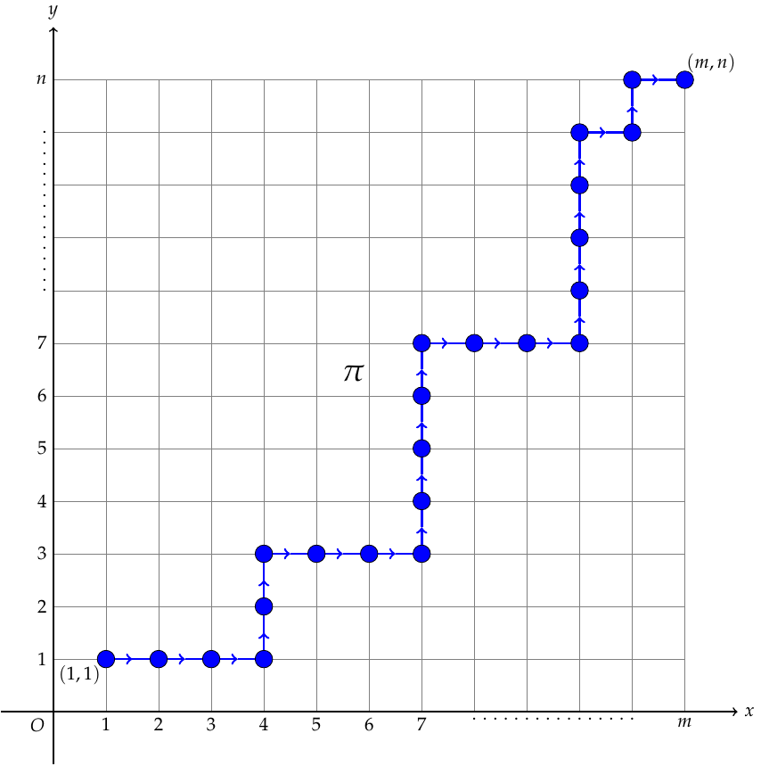


## IPS

```tex
\documentclass[tikz]{standalone}
\usepackage{pgfplots}
\usepackage{mathpazo}
\usepgfplotslibrary{polar}
\usepgflibrary{shapes.geometric}
\usetikzlibrary{calc}
\usetikzlibrary{datavisualization}
\usetikzlibrary{datavisualization.formats.functions}
\pgfplotsset{compat=1.12} 
\pgfplotsset{my style/.append style={axis x line=middle, axis y line=middle, xlabel={$x$},ylabel={$y$},smooth}}
\begin{document}
\begin{tikzpicture}[thick]
	%axes
	\draw[thick] (-6, 1) -- (-1, 1);
	\draw (1, 1) -- (6, 1);
	\draw[yshift=1cm] (-6, -6) -- (-1, -6);
	\draw[yshift=1cm] (1, -6) -- (6, -6);
	%A left
	\draw (-5.5, 2) --(-4.5, 3);
	\draw (-4.5, 3) --(-3.5, 2);
	\draw (-3.5, 2) --(-2.5, 3);
	\draw (-2.5, 3) -- (-1.5, 2);
	\draw[dashed, thick] (-4.5, 3) -- (-3.5, 4);
	\draw[dashed] (-3.5, 4) -- (-2.5, 3);
	\draw[dashed, thin] (-5, 1) -- (-5, 2.5);
	\draw[dashed, thin] (-4, 1) -- (-4, 2.5);
	\draw[dashed, thin] (-3, 1) -- (-3, 2.5);
	\draw[dashed, thin] (-2, 1) -- (-2, 2.5);
	\draw[->, very thick,blue] (-4, 0.9) arc [start angle = 190, end angle = 350, radius =0.47];
	%\fill [black] (-5, 1) circle (2pt);
	%\fill [white,opacity=0.5] (-4, 1) circle (2pt);
	\draw 
			(-5, 1) node [fill=white,circle,minimum size=1pt,draw]{}
			(-4, 1) node [fill=black,circle,minimum size=1pt,draw]{}
			(-3, 1) node [fill=white,circle,minimum size=1pt,draw]{}
			(-4.5, 3) node [fill=black,circle,minimum size=1pt,draw]{}
			(-3.5, 2) node [fill=black,circle,minimum size=1pt,draw]{}
			(-2.5, 3) node [fill=black,circle,minimum size=1pt,draw]{}
			(-3.5, 4) node [fill=white,circle,minimum size=1pt,draw]{}
			(-3, 1) node [fill=white,circle,minimum size=1pt,draw]{}
			(-2, 1) node [fill=black,circle,minimum size=1pt,draw]{};
	\draw[blue, ultra thick,->] (-1, 2.5) -- (1, 2.5);
	%A right 
	\draw (5.5, 2) --(4.5, 3);
	\draw (4.5, 3) --(3.5, 4);
	\draw (3.5, 4) --(2.5, 3);
	\draw (2.5, 3) -- (1.5, 2);
	\draw[dashed, thin] (5, 1) -- (5, 2.5);
	\draw[dashed, thin] (4, 1) -- (4, 3.5);
	\draw[dashed, thin] (3, 1) -- (3, 3.5);
	\draw[dashed, thin] (2, 1) -- (2, 2.5);
	\draw 
			(5, 1) node [fill=black,circle,minimum size=1pt,draw]{}
			(4, 1) node [fill=black,circle,minimum size=1pt,draw]{}
			(3, 1) node [fill=white,circle,minimum size=1pt,draw]{}
			(2, 1) node [fill=white,circle,minimum size=1pt,draw]{}
			(4.5, 3) node [fill=black,circle,minimum size=1pt,draw]{}
			(3.5, 4) node [fill=black,circle,minimum size=1pt,draw]{}
			(2.5, 3) node [fill=black,circle,minimum size=1pt,draw]{};
			%(-3.5, 4) node [fill=white,circle,minimum size=1pt,draw]{}
			%(-3, 1) node [fill=white,circle,minimum size=1pt,draw]{};
	\draw (0, 0) node {(A)};
	%B left
	\draw[yshift = 1cm] (0, -7) node {(B)};
	\draw[yshift = 1cm] (-5.5, -5) --(-4.5, -4)
	 		(-4.5, -4) --(-3.5, -3)
	 		(-3.5, -3) --(-2.5, -4)
	 		(-2.5, -4) --(-1.5, -5);
	\draw[dashed, thin, yshift = 1cm] (-5, -6) -- (-5, -4.5)
	 						 (-4, -6) -- (-4, -3.5)
							 (-3, -6) -- (-3, -3.5)
							 (-2, -6) -- (-2, -4.5);
	\draw[yshift = 1cm] 
			(-5, -6) node [fill=white,circle,minimum size=1pt,draw]{}
			(-4, -6) node [fill=white,circle,minimum size=1pt,draw]{}
			(-3, -6) node [fill=black,circle,minimum size=1pt,draw]{}
			(-2, -6) node [fill=black,circle,minimum size=1pt,draw]{}
			(-4.5, -4) node [fill=black,circle,minimum size=1pt,draw]{}
			(-3.5, -3) node [fill=black,circle,minimum size=1pt,draw]{}
			(-2.5, -4) node [fill=black,circle,minimum size=1pt,draw]{};
	\draw[->, very thick,blue, yshift = 1cm] (-3, -6.09) arc [start angle = 0, end angle = -170, radius =0.47];
	\draw[blue, ultra thick,->,yshift = 1cm] (-1, -4) -- (1, -4);
	% B right
	\draw[yshift = 1cm] (5.5, -5) --(4.5, -4)
	 		(4.5, -4) --(3.5, -5)
	 		(3.5, -5) --(2.5, -4)
	 		(2.5, -4) -- (1.5, -5);
	\draw[dashed, thick, yshift = 1cm] (4.5, -4) -- (3.5, -3);
	\draw[dashed,yshift = 1cm] (3.5, -3) -- (2.5, -4)
	 				 (5, -6) -- (5, -4.5)
					 (4, -6) -- (4, -4.5)
					 (3, -6) -- (3, -4.5)
					 (2, -6) -- (2, -4.5);
	%\draw[->, very thick,blue,yshift=1cm] (-4, 0.9) arc [start angle = 190, end angle = 350, radius =0.47];
	%\fill [black] (-5, 1) circle (2pt);
	%\fill [white,opacity=0.5] (-4, 1) circle (2pt);
	\draw[yshift = 1cm] 
			(5, -6) node [fill=black,circle,minimum size=1pt,draw]{}
			(4, -6) node [fill=white,circle,minimum size=1pt,draw]{}
			(3, -6) node [fill=black,circle,minimum size=1pt,draw]{}
			(2, -6) node [fill=white,circle,minimum size=1pt,draw]{}
			(4.5, -4) node [fill=black,circle,minimum size=1pt,draw]{}
			(3.5, -3) node [fill=white,circle,minimum size=1pt,draw]{}
			(2.5, -4) node [fill=black,circle,minimum size=1pt,draw]{}
			(3.5, -5) node [fill=black,circle,minimum size=1pt,draw]{};
\end{tikzpicture}
\end{document}
```

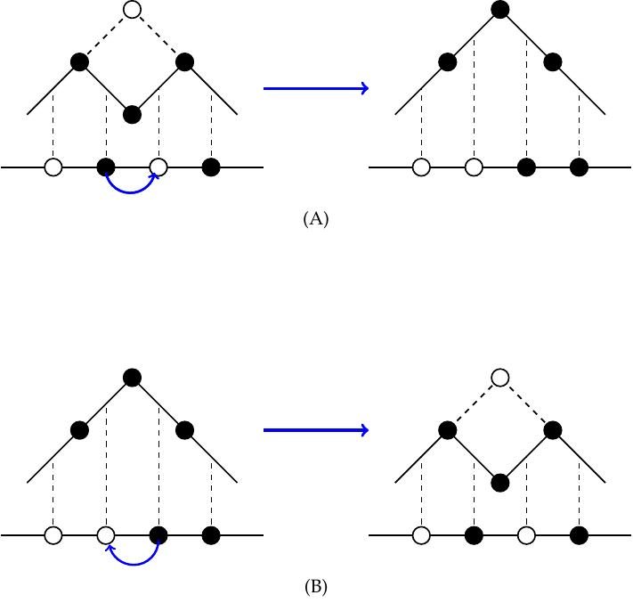

## Contour

```tex
\documentclass[tikz]{standalone}
\usepackage{pgfplots}
\usepackage{mathpazo}
\usepackage{amsmath}
\usepgfplotslibrary{polar}
\usepgflibrary{shapes.geometric}
\usetikzlibrary{calc}
\usetikzlibrary{datavisualization}
\usetikzlibrary{datavisualization.formats.functions}
\usetikzlibrary{intersections}
\usetikzlibrary{scopes}
\pgfplotsset{compat=1.12} 
\pgfplotsset{my style/.append style={axis x line=middle, axis y line=middle, xlabel={$x$},ylabel={$y$},smooth}}
\begin{document}
\begin{tikzpicture}
	\draw[->, thick] (-5, 0) -- (6, 0) node[right] {$x$};
	\draw[->, thick] (0, -5) -- (0, 6) node[above] {$y$};
	\draw[->] (0, 0) circle [radius = 2];
	\draw[->, very thick] (1, 1.732) arc [start angle = 60, end angle = 61, radius=2];
	\foreach \x/\xtext in {0/O, 2/\delta_1, 4/\delta_2}
		\draw[xshift = \x cm - 0.3 cm] node[below]{$\xtext$};
	\draw[yshift = 0.3cm] (0, 2) node[left]{$\delta_1$};
	\draw[->, very thick] (4, -4.8) -- (4, 3);
	\draw[very thick] (4, 3) -- (4, 6);
	%\draw[circle, draw ] (0, 0) node[fill= black, draw,minimum size = 0.05 cm]{}
							 %(0, 2) node[fill = black, draw, minimum size = 0.05 cm]{}
							 %(2, 0) node[fill = black, draw, minimum size = 0.05 cm]{}
							 %(4, 0) node[fill = black, draw, minimum size = 0.5 pt]{};
\end{tikzpicture}
\end{document}
```

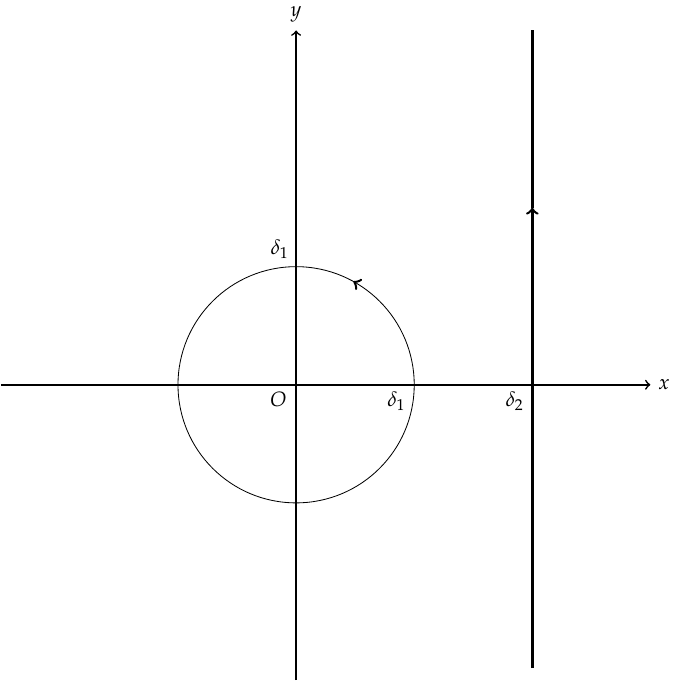

## TWGraph

```tex
\documentclass{standalone}
\usepackage{tikz}
\usepackage{pgf}
\begin{document}
\begin{tikzpicture}
	%learn to try
	\draw[gray, very thin] (-5, 0) grid[xstep=1, ystep= 0.8] (4, 4.8);
	%axes
	\draw[thick] (-5, 0) -- (4, 0)
					(-5, 0) -- (-5, 4.8);
	\foreach \x in {-5, -4, -3 ,-2, -1, 0, 1, 2, 3, 4}
		\draw [xshift = \x cm] (0 pt, 1pt) -- (0 pt, -1pt) node[below] {$\x$};
	\foreach \y/\ytext in {0, 0.8/0.1, 1.6/0.2, 2.4/0.3, 3.2/0.4, 4.0/0.5, 4.8/0.6}
		\draw [xshift = -5 cm, yshift = \y cm] (-1pt, 0pt) -- (1pt, 0pt) node[left] {$\ytext$};
	\draw (4, 0) node[right] {$x$}
			(-5, 4.9) node[above] {$F_2(x)$};
	\draw[very thick] (-3.7, 0.32) .. controls (-3, 0.89) and (-2.5, 3.2) .. (-1.9, 3.5)
		   (-1.9, 3.5) .. controls (-1.2, 3.8) and (-0.9, 1.4) .. (0, 0.45)
		   (0, 0.45) .. controls (0.45, 0.08) and (1.0, 0) .. (1.8, 0)
		   (1.8, 0) -- (2.3, 0);
\end{tikzpicture}
\end{document}
```

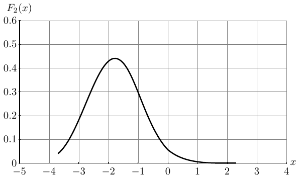

## Young

```tex
\documentclass{standalone}
\usepackage{tikz}
\usepackage{pgf}
\begin{document}
\begin{tikzpicture}
	%learn to try
	\filldraw[white] (0, 11) circle;
	\draw[gray, very thin] (0, 0) grid (1, 10)
								 (1, 1) grid (3, 10)
								 (3, 4) grid (4, 10)
								 (4, 5) grid (6, 10)
								 (6, 6) grid (7, 10)
								 (7, 7) grid (9, 10)
								 (9, 8) grid (11, 10)
								 (11, 9) grid (14, 10);
	\LARGE
	\draw[yshift = 0.5 cm, xshift = 0.5 cm] (-1, 5) node {\LARGE $l$}
			(1, 0) node {\LARGE $\lambda_l$}
			(3, 1) node {\LARGE$\lambda_{l-1}$}
			(7, 6) node {$\lambda_4$}
			(9, 7) node {$\lambda_3$}
			(11, 8) node {$\lambda_2$}
			(14, 9) node {$\lambda_1$};
	\filldraw[white] (0, -1) circle;
	%axes
\end{tikzpicture}
\end{document}
```

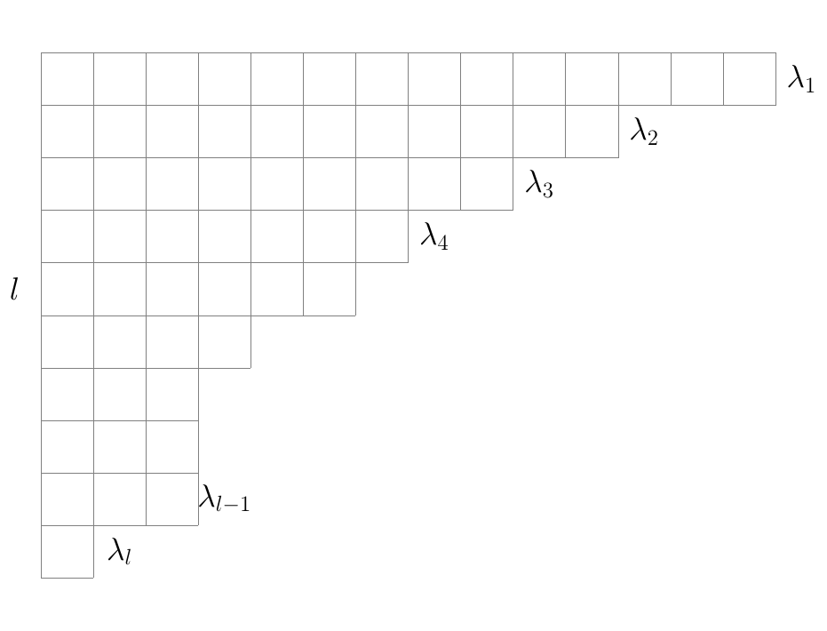

## AiryGraph

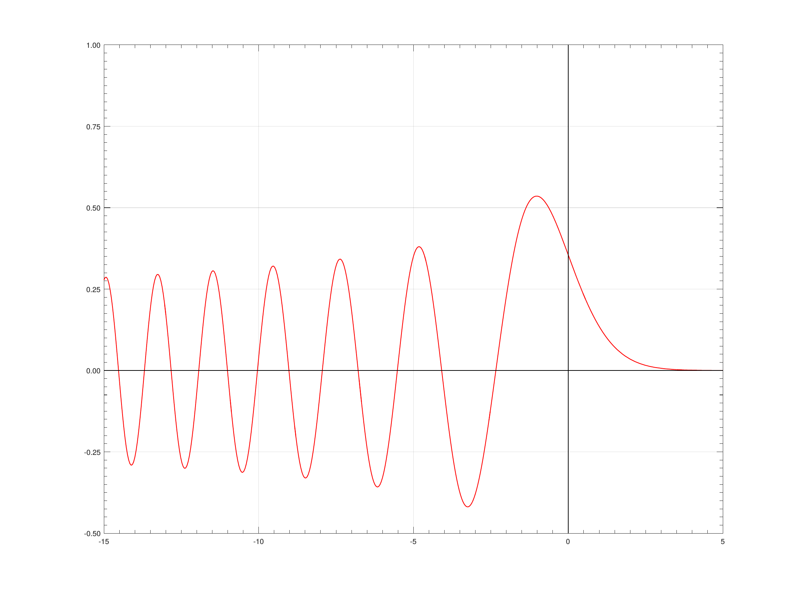

```matlab
%x=-5:10; y=-5:10;
x = -4:0.1:4;
y = 1/sqrt(2*pi)*exp(-x.^2/2);
plot(x,y); axis off; hold on;
plot([0 0],[min(y) max(y)],'k',[min(x) max(x)],[0 0],'k');
ax=[max(x),0.99*max(x),0.99*max(x);0,0.01*(max(y)-min(y)),-0.01*(max(y)-min(y))];
fill(ax(1,:),ax(2,:),'k');
ay=[0,0.15,-0.15;max(y),max(y)-0.4,max(y)-0.4];
fill(ay(1,:),ay(2,:),'k'); hold on
for i=1:length(x)-1
    if x(i)~=0
        plot([x(i),x(i)],[0,0.1],'k'); hold on
        %a=text(x(i),-0.4,num2str(x(i)));
        set(a,'HorizontalAlignment','center')
    end
    if y(i)~=0
        plot([0,0.1],[y(i),y(i)],'k'); hold on
        %b=text(-0.4,y(i),num2str(y(i)));
        set(b,'HorizontalAlignment','center')
    end
end
c=text(-0.4,-0.4,num2str(0));
set(c,'HorizontalAlignment','center')
```

## OY

```tex
\documentclass[tikz]{standalone}
\usepackage{pgfplots}
\usepackage{mathpazo}
\usepgfplotslibrary{polar}
\usepgflibrary{shapes.geometric}
\usetikzlibrary{calc}
\usetikzlibrary{datavisualization}
\usetikzlibrary{datavisualization.formats.functions}
\pgfplotsset{compat=1.12} 
\pgfplotsset{my style/.append style={axis x line=middle, axis y line=middle, xlabel={$x$},ylabel={$y$},smooth}}
\begin{document}
\begin{tikzpicture}[scale=1]
	\draw[->,thick] (-1, 0) -- (15, 0) node[right] {};
	\draw[->,thick]	(0, -1) -- (0, 11) node[above] {};
	\draw[xstep = 14, ystep = 1] (0, 0) grid (14, 10);
	\foreach \x/\xtext in { 1.2/{S_1}, 3.5/{S_2}, 4.4/{S_3}, 9.4/S_{n-2},12.5/S_{n-1}, 14/t}
		{\draw (\x, 0) node[below] {$\xtext$};
		\filldraw (\x, 0) circle[radius = 2pt];}
	\foreach \x in {5.4, 5.6, ...,8.4}
		\draw[xshift = \x cm] node[below] {$.$};
	\foreach \y in {1, 2, 3}
		\draw[yshift=\y cm] node[left] {$\y$};
	\foreach \y in {4, 4.2,...,8}
		\draw[yshift=\y cm] node[left] {$.$}; 
	\foreach \y/\ytext in {9/{n-1}, 10/n}
		\draw[yshift=\y cm] node[left] {$\ytext$};
	\draw[ultra thick] (0, 1) -- (1.2, 1) node[midway,below] {$B_1$}
						  (1.2, 2) -- (3.5, 2) node[midway,below] {$B_2$}
						  (3.5, 3) -- (4.4, 3) node[midway, below] {$B_3$}
						  (9.4, 9) -- (12.5, 9) node[midway, below] {$B_{n-1}$}
						  (12.5, 10) -- (14, 10) node[midway, below] {$B_{n}$};
	\draw[xshift = 0.5cm, yshift=0.5cm] (14, 10) node {$(n,t)$}
												 (-1, -1) node {$O$}; 
\end{tikzpicture}
\end{document}
```

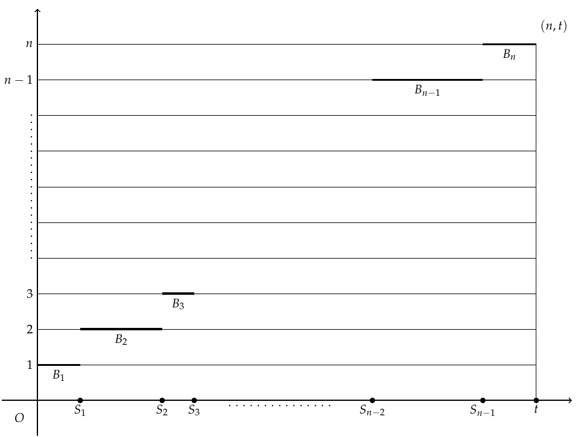

